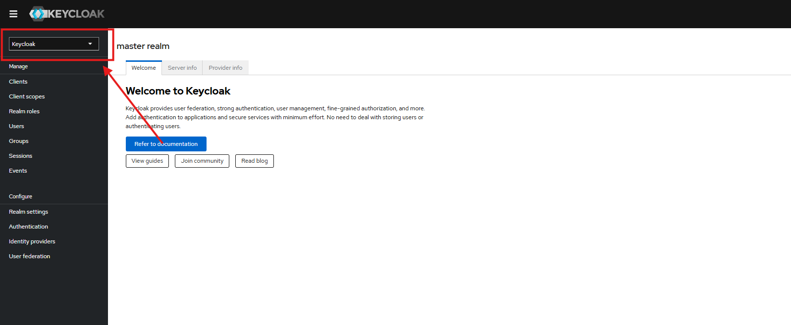
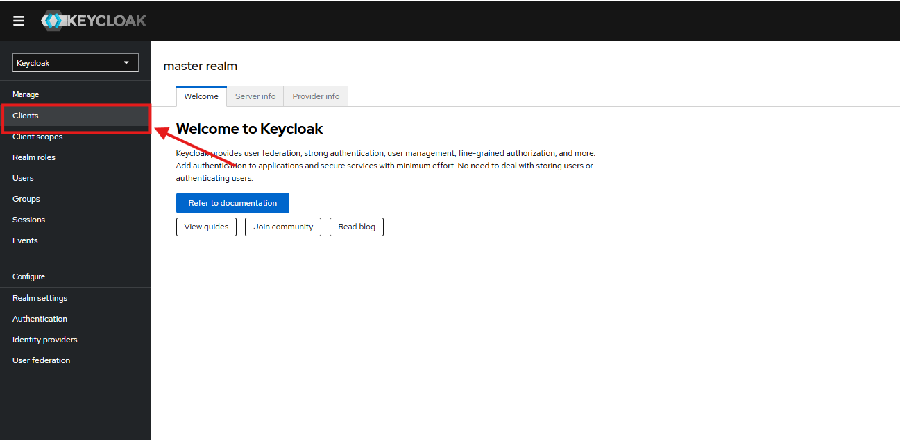
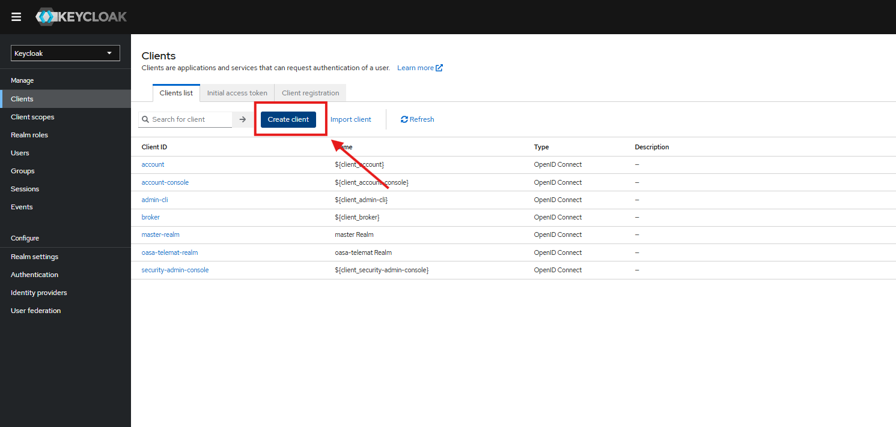
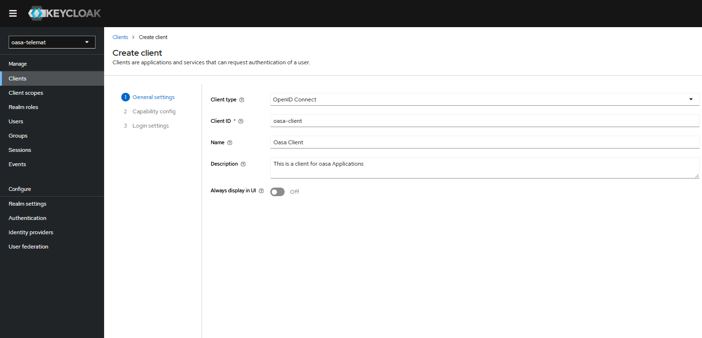
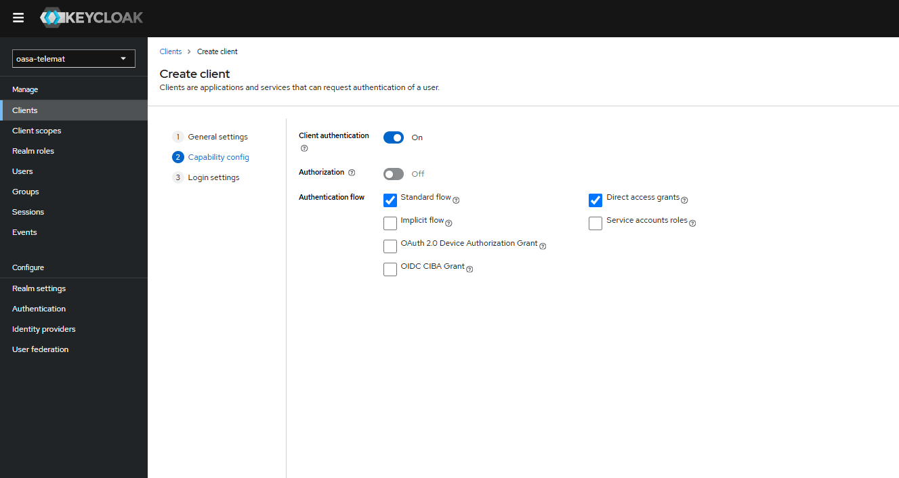
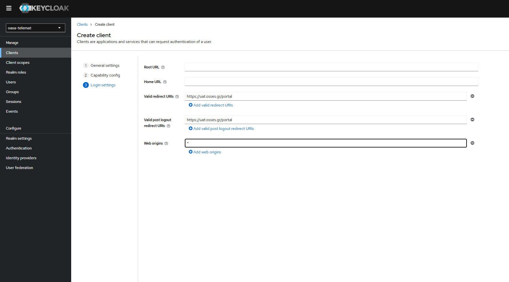
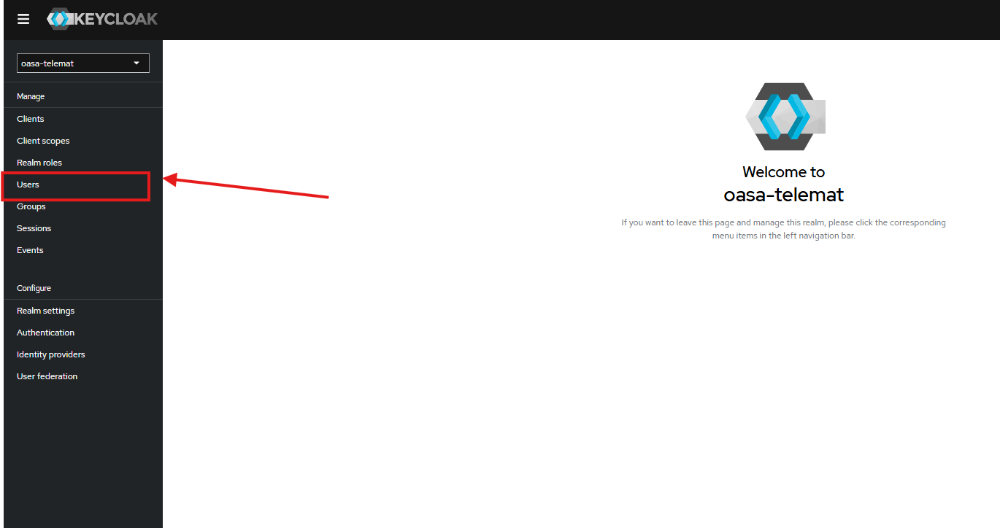
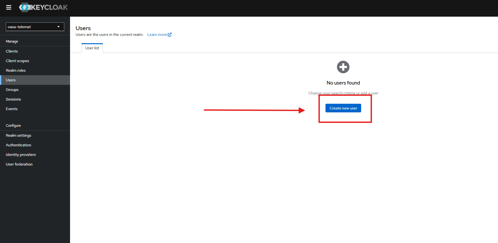
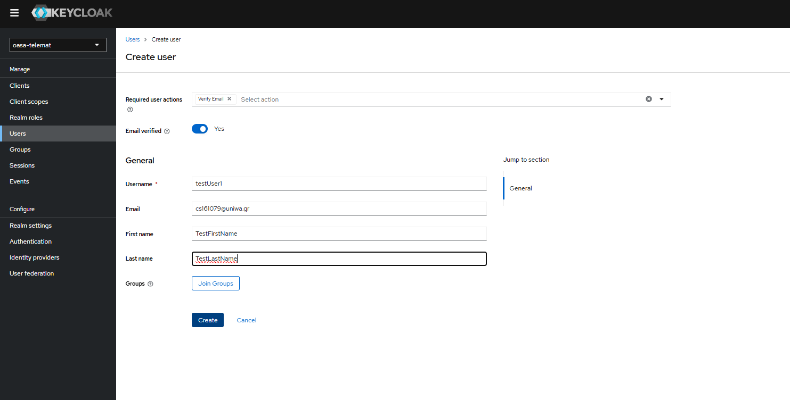

# 🚌 Τηλεματική ΟΑΣΑ – Server

Το παρόν project αποτελεί το **Πρακτικό μέρος** της διπλωματικής με θέμα **Τηλεματική Λεvφoρείων με Χρήση τεχνιτής νοημασύνης** .  
Σκοπός του είναι η συλλογή, επεξεργασία και διάθεση δεδομένων σε πραγματικό χρόνο που αφορούν:
- Θέσεις λεωφορείων
- Χρόνους αναμονής στις στάσεις
- Δρομολόγια και χρονοδιαγράμματα
- Προτάσεις προσθήκης ή αφαίρεσης δρομολογίων

---

## Οδηγείες για το Kubernetes Cluster
Στον Cluster γίνονται deploy όλες οι εφαρμογές που αφορούν το backend. Αυτές είναι η βάση δεδομένων, ο Application Server, ο Authendicator Server και το CronJob που συγχρονίζει τα δεδομένα. Επομένως πως μπορούμε να εκτελέσουμε όλα αυτά στον Cluster με μία σειρά εντολών. 
Πρώτα πρέπει να δημειουργηθεί η βάση δεδομένων και μετά όλα τα υπολοιπα. Αυτό γιατί όλα χρησιμοποιούν την βάση δεδομένων, σε περιπτωση που γίνουν με άλλη σειρά δεν υπάρχει κάποιο πρόβλημα γιατί έχουν σχεδιαστεί όλα με τέτοιο τρόπο ώστε να περίμένουν μέχρι όλες οι εξαρτήσεις είναι έτοιμες.

Εδώ κάνουμε δημιουργία το Namespace που θα στήσουμε μέσα σε αυτό όλα τα παραπάνω. 
    
**Θυμίζουμε ότι το namespace είναι είναι ένας λογικός διαχωρισμός πόρων σε απομονομένα σύνολα ώστε να οργανόνονται, να διαχειρίζονται και να ελέγχονται πιο ευκκολα.

```
kubectl create namespace oasa-telemat
```

Δημιουργία βάσης δεδομένων
```
cd monorepo_internal
kubectl apply -k kube/mysql
```

Δημιουργία Authendicator Server
```
kubectl apply -k kube/keycloak
```
Μετά την δημιοργία του της εφαρμογής του Authendicator θα πρέπει να γίνου ενεργείες στο διαχειριστικό του.

- Κάνουμε login με τα Credentials του διαχειριστή
- Πατάμε πάνω αριστερά, σε ένα Dropdown για να δημιουργήσουμε ένα νέο relame
    
- Αφού δημιοργήσουμε το realm θα πρέπεί να κάνουμε αλλαγή στο realm και να δημιουργήσουμε ένα Client-id.
    
    
    
    
    
- Θα πρέπει να δημιουργήσουμε και ένα test χειριστή που θα χρησιμοποιήσουμε. Η δημιουργία του χειριστή θα γίνει ακολουθώντας τα παρακάτω βήματα




### Setup Application Server
1) Εφόσον κάνουμε Build το Docker image 

```
docker build -f docker/oasa-api.Dockerfile -t localhost:5000/oasa-api:0.0.1 --network=host .
```

2) Με την χρήση Kustomization θα κάνουμε Depoloy την εφαρμογη και ότι άλλο χρειάζεται.
```
kubectl apply -k kube/server
```
### Set OTP Deployment
1) Θα πρέπει να κάνουμε Build το Docker image με την παρακάτω εντολή.
```
docker build -f docker/trip-planner-api.Dockerfile -t localhost:5000/trip-planner-api:0.0.8 --network=host .
```
2) Να κάνω Deploy την εφαρμογή στο Cluster δημιουργώντας και ότι άλλο χρειάζεται χρησιμοποιώντας Kustomization.

```
kubectl apply -k kube/open-trip-planer/
```
### Set up Cronjon

1) Πρέπει να κάνουμε Build το Docker Image

```
docker build -f docker/oasa-job.Dockerfile -t localhost:5000/oasa-job:0.0.1 --network=host .
```

2) Μετά πρέπει να κάνουμε deploy το Cronjob στον Cluster. Με την χρήση Kustomization θα δημιουργήσουμε το CornJob και ότι άλλο χρειάζεται

```
kubectl apply -k kube/cronjob
```


## Admin Portal
Είναι μία Web Εφαρμογή με την οποία ο διαχειρηστής του οργανισμού μεταφορών μπορεί να δει πληροφορίες αλλά και να κάνει ενέργει εκ των οποίων είναι η αποστολή ειδοποιήσεων στους χειριστές της Mobile εφαρμογής αλλά και η προσθήκη ή μειώση δρομολογίου ανάλογα με τις προτάσεις του συστήματος.

Για την εκτέλεση της εφαρμογής
``` 
cd admin-bus
npm install
ng serve
```

## Mobile Εφαρμογή
Είναι μία εφαρμογή για τα κινητά android η οποία απευθύνεται καθαρά στο χειριστή. Με αυτή την εφαρμογή ο χειριστής μπορεί να πληροφορίες για τα λεωφορέια που βρίσκονται, όπως ακομά και την πληρότητα των επιβατών.

Για την δημιουργία εκτελέσημου

```
cd bus-telematic-android
npm install
ionic cap sync
```

Μετά πρέπει με το Android Studio αν ανοίξουμε το φάκελο bus-telematic-mobile\android και να κάνουμε build την εφαρμογή και να παράξουμε ένα APK.

## 📖 Περιεχόμενα
- [Περιγραφή](#-περιγραφή)
- [Τεχνολογίες](#-τεχνολογίες)
- [Προαπαιτούμενα](#-προαπαιτούμενα)
- [Εγκατάσταση](#-εγκατάσταση)
- [Χρήση](#-χρήση)
- [API](#-api)
- [Συνεισφορά](#-συνεισφορά)
- [Άδεια](#-άδεια)

---

## 🚀 Περιγραφή
Ο server λειτουργεί ως μεσολαβητής μεταξύ:
- Των συσκευών τηλεματικής στα οχήματα
- Της βάσης δεδομένων
- Των εφαρμογών/clients (mobile app, web app, APIs τρίτων)

Παρέχει RESTful API endpoints για άντληση πληροφορίας και δυνατότητες real-time streaming (π.χ. μέσω WebSocket).

---

## ⚙️ Τεχνολογίες
- **Backend:** GO
- **GronJob:** GO
- **Βάση Δεδομένων:** MySQL  
- **Επικοινωνία:** REST API  
- **Containerization:** Docker
- **Orchestration:** Kubernetes 

---

## 🛠 Προαπαιτούμενα
- Docker (προαιρετικά, για εύκολη εκτέλεση)
- Kubernetes 

---

## 📦 Εγκατάσταση
1. Κλωνοποίησε το αποθετήριο:
   ```bash
   git clone https://github.com/cs161079/monorepo.git
   cd monorepo
2. Build docker images:
    - Build docker image για την server εφαρμογή
    ```bash
    docker build -f docker/oasa-api.Dockerfile -t [registry-host[:port]/][namespace/]<repository-name>[:tag] .
    docker push
    ```
    - Build docker image για την Cronjob εφαρμογή
    ```bash
    docker build -f docker/oasa-job.Dockerfile -t [registry-host[:port]/][namespace/]<repository-name>[:tag] .
    docker push
    ```
    - Build docker image για την εφαρμογή OTP
    ```bash
    docker build -f docker/trip-planner-api.Dockerfile -t [registry-host[:port]/][namespace/]<repository-name>[:tag] .
    docker push
    ```
3. Deploy to Kubernetes Cluster

## Οδηγείες εγκατάστασης πιστοποιητικού Lets Encrypt στο Cluster
0) Προαπαιτούμενα (γρήγορος έλεγχος)
    - Έχεις Ingress Controller (nginx) με EXTERNAL-IP/hostname.
    - Το DNS του uat.osses.gr δείχνει στο LoadBalancer του ingress.
    - Namespace της εφαρμογής: oasa-telemat.
    - Service της εφαρμογής ακούει π.χ. στο 8080.
    - Για HTTP-01: η port 80 είναι ανοιχτή, χωρίς server-level redirect 80→443 στο /.well-known/acme-challenge/*.
1) Εγκατάσταση cert-manager (μία φορά στο cluster)
    ```bash
    kubectl apply -f https://github.com/cert-manager/cert-manager/releases/download/v1.14.4/cert-manager.yaml
    kubectl -n cert-manager rollout status deploy/cert-manager
    ```
2) Δημιουργία ClusterIssuer
    - Επιλογή Α — ClusterIssuer με HTTP-01 (nginx ingress)

    ```yaml
    # cluster-issuer-http01.yaml
    apiVersion: cert-manager.io/v1
    kind: ClusterIssuer
    metadata:
    name: letsencrypt-prod
    spec:
    acme:
        email: cs161079@uniwa.gr
        server: https://acme-v02.api.letsencrypt.org/directory
        privateKeySecretRef:
        name: letsencrypt-prod-account-key
        solvers:
        - http01:
            ingress:
                class: nginx              # <-- Εναλλακτικά:
                # ingressClassName: nginx # (αν ο controller σου περιμένει αυτό)
    ```

    ```bash
    kubectl apply -f cluster-issuer-http01.yaml
    ```
    - Επιλογή Β — ClusterIssuer με DNS-01 (Cloudflare)
    1. Δημιούργησε Cloudflare API Token με Zone:Read και DNS:Edit (περιορισμένο στη ζώνη σου).
    2. Φτιάξε το Secret στο namespace cert-manager:
    ```bash
    kubectl -n cert-manager create secret generic cloudflare-api-token-secret \
    --from-literal=api-token='<CF_API_TOKEN>'
    ```
    3. Φτιάξε τον ClusterIssuer:
    ```yaml
    # cluster-issuer-dns01.yaml
    apiVersion: cert-manager.io/v1
    kind: ClusterIssuer
    metadata:
    name: letsencrypt-dns
    spec:
    acme:
        email: cs161079@uniwa.gr
        server: https://acme-v02.api.letsencrypt.org/directory
        privateKeySecretRef:
        name: letsencrypt-dns-account-key
        solvers:
        - selector:
            dnsZones:
                - "osses.gr"
            dns01:
            cloudflare:
                apiTokenSecretRef:
                name: cloudflare-api-token-secret
                key: api-token
            # cnameStrategy: Follow   # αν έχεις CNAME delegation για _acme-challenge
    ```

    ```bash
    kubectl apply -f cluster-issuer-dns01.yaml
    ```
3) Δημιουργία Certificate στο namespace της εφαρμογής

    **Για single host** (π.χ. uat.osses.gr)
    ```yaml
    # certificate.yaml
    apiVersion: cert-manager.io/v1
    kind: Certificate
    metadata:
    name: keycloak-tls
    namespace: oasa-telemat
    spec:
    secretName: keycloak-tls
    issuerRef:
        kind: ClusterIssuer
        name: letsencrypt-prod     # ή letsencrypt-dns αν πας με DNS-01
    dnsNames:
        - uat.osses.gr
    ```

    **Για wildcard (DNS-01 μόνο)**
    ```yaml
    # certificate-wildcard.yaml
    apiVersion: cert-manager.io/v1
    kind: Certificate
    metadata:
    name: wildcard-osses-gr
    namespace: oasa-telemat
    spec:
    secretName: wildcard-osses-gr
    issuerRef:
        kind: ClusterIssuer
        name: letsencrypt-dns
    dnsNames:
        - "*.osses.gr"
        - "osses.gr"       # προαιρετικό, για το root
    ```

    ```bash
    kubectl apply -f certificate.yaml          # ή certificate-wildcard.yaml
    ```
4) Ingress της εφαρμογής να χρησιμοποιεί το Secret
    ```yaml
    # ingress.yaml (παράδειγμα)
    apiVersion: networking.k8s.io/v1
    kind: Ingress
    metadata:
    name: keycloak
    namespace: oasa-telemat
    annotations:
        kubernetes.io/ingress.class: "nginx"             # ή spec.ingressClassName: nginx
        cert-manager.io/cluster-issuer: "letsencrypt-prod"  # μόνο αν ΘΕΛΕΙΣ ingress-shim
        nginx.ingress.kubernetes.io/ssl-redirect: "true" # ΟΧΙ server-level 308
    spec:
    tls:
        - hosts:
            - uat.osses.gr
        secretName: keycloak-tls                        # ίδιο με Certificate.spec.secretName
    rules:
        - host: uat.osses.gr
        http:
            paths:
            - path: /
                pathType: Prefix
                backend:
                service:
                    name: keycloak
                    port:
                    number: 8080
    ```

    > [!NOTE] 
    > Αν κρατάς ρητό Certificate, μπορείς να αφαιρέσεις το annotation cert-manager.io 
    cluster-issuer (για να μην δημιουργεί δεύτερο auto-Certificate).

5) Έλεγχοι / Παρακολούθηση

```bash
# Κατάσταση του Certificate
kubectl -n oasa-telemat describe certificate keycloak-tls
kubectl -n oasa-telemat get secret keycloak-tls

# ACME resources
kubectl -n oasa-telemat get certificaterequests.acme.cert-manager.io
kubectl -n oasa-telemat get orders.acme.cert-manager.io
kubectl -n oasa-telemat get challenges.acme.cert-manager.io -o wide

# Logs του cert-manager
kubectl -n cert-manager logs deploy/cert-manager --tail=200 -f
```

**HTTP-01 μόνο:**
- Επιβεβαίωσε ότι η 80 είναι ανοιχτή και δεν υπάρχει server-level redirect 80→443:
```bash
curl -v http://uat.osses.gr/.well-known/acme-challenge/test
```
(Κατά την έκδοση θα δεις προσωρινό solver Ingress cm-acme-http-solver-*.)

**Τελικός έλεγχος “live” cert:**
```bash
LB=$(kubectl -n ingress-nginx get svc ingress-nginx-controller -o jsonpath='{.status.loadBalancer.ingress[0].ip}')
openssl s_client -servername uat.osses.gr -connect ${LB}:443 </dev/null 2>/dev/null | openssl x509 -noout -subject -issuer -dates
```

