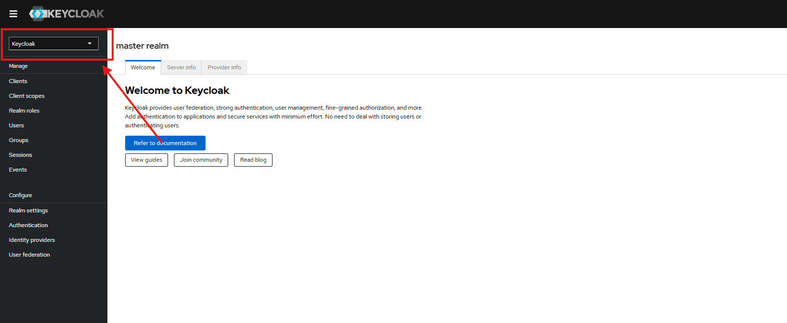
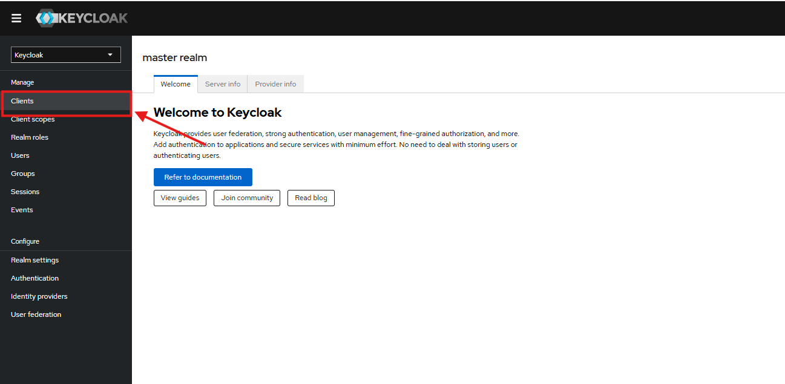
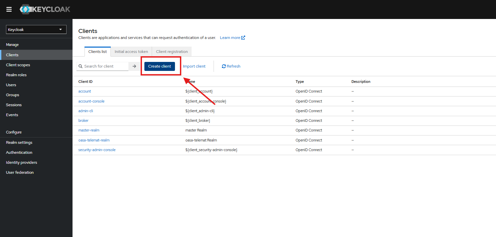
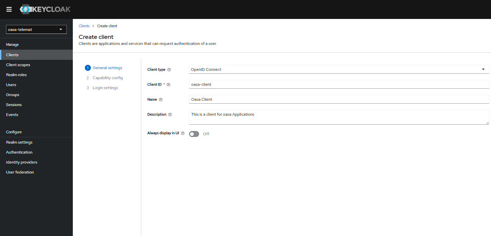
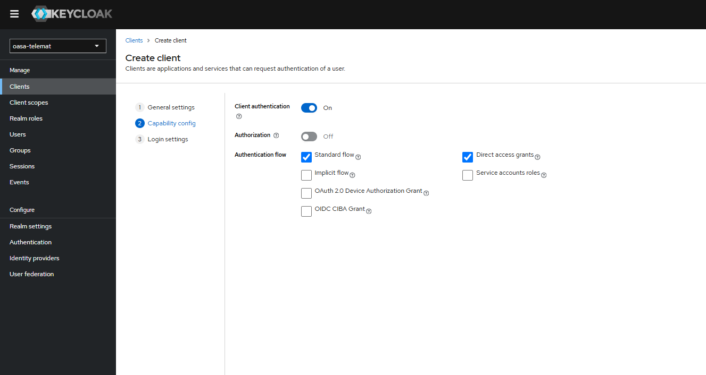
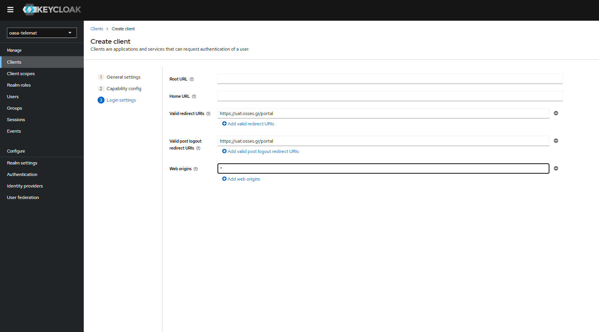
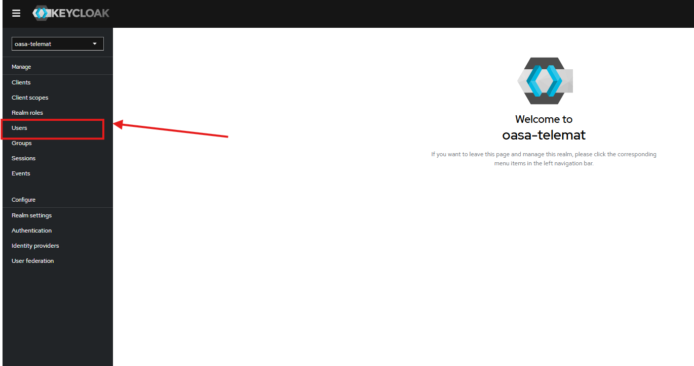
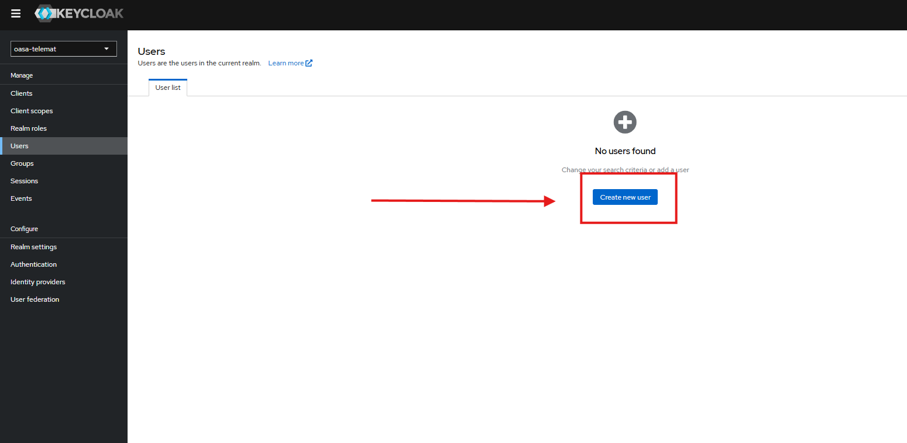
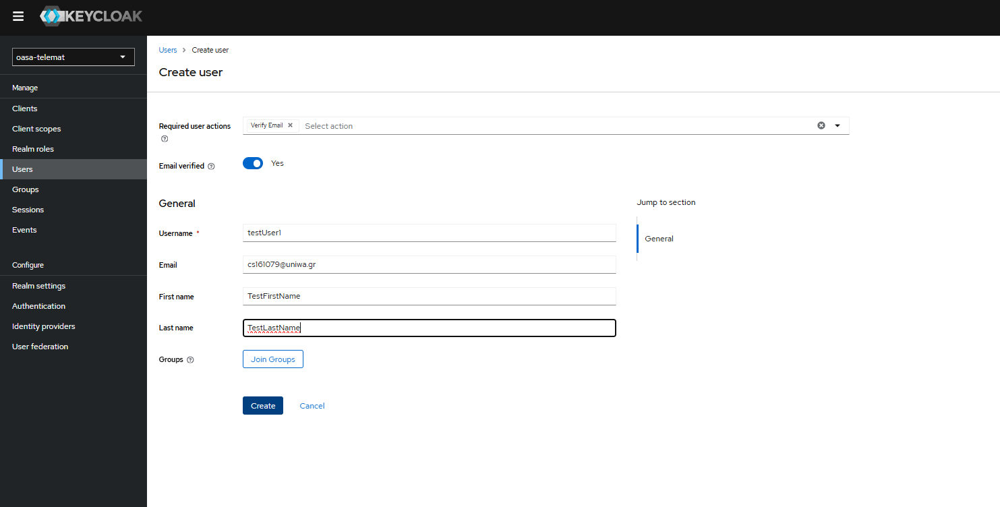

# 🚌 Τηλεματική ΟΑΣΑ – Server

Το παρόν project αποτελεί το μέρος διπλωματικής με θέμα **Τηλεματική Λεvφoρείων με Χρήση τεχνιτής νοημασύνης** .  
Σκοπός του είναι η συλλογή, επεξεργασία και διάθεση δεδομένων σε πραγματικό χρόνο που αφορούν:
- Θέσεις λεωφορείων
- Χρόνους αναμονής στις στάσεις
- Δρομολόγια και χρονοδιαγράμματα
- Προτάσεις προσθήκης ή αφαίρεσης δρομολογίων
- Δρομολόγιση από σημείο Α σε σημείο Β συνδιασμός κίνησης με ΜΜΜ και πεζής.

---

## 📖 Περιεχόμενα
- [Οδηγείες για το Kubernetes Cluster](#οδηγείες-για-το-kubernetes-cluster)
- [Δημιουργία βάσης δεδομένων](#δημιουργία-βάσης-δεδομένων)
- [Δημιουργία Authendicator Server](#δημιουργία-authendicator-server)
- [Δημιουργία Application Server](#δημιουργία-application-server)
- [Δημιουργία OTP Server](#δημιουργία-otp-server)
- [Δημιουργία Cronjob](#δημιουργία-cronjob)
- [Δημιουργία Admin Portal](#δημιουργία-admin-portal)
- [Δημιοργία Mobile Εφαρμογή](#δημιοργία-mobile-εφαρμογή)


## Οδηγείες για το Kubernetes Cluster
Στον Cluster γίνονται deploy όλες οι εφαρμογές, όπως η βάση δεδομένων, ο Application Server, o OTP server, ο Authenticator server και ένα Cronjob που εκτελείται περιοδικά. Επομένως παρακάτω ακολουθούν οδηγείες εγκατάστασης και παραμετροποιήσης των εφαρμογών στoν Cluster.

1) Δημιουργία το Namespace. 
    
**Θυμίζουμε ότι το namespace είναι ένας λογικός διαχωρισμός πόρων σε απομονομένα σύνολα ώστε να οργανόνονται, να διαχειρίζονται και να ελέγχονται πιο ευκκολα.

```
kubectl create namespace oasa-telemat
```

### Δημιουργία βάσης δεδομένων
```
cd monorepo
kubectl apply -k kube/mysql
```

### Δημιουργία Authendicator Server
```
kubectl apply -k kube/keycloak
```
Μετά την δημιοργία της εφαρμογής του Authendicator θα πρέπει να γίνου ενεργείες στο διαχειριστικό του περιβάλλον.

- Κάνουμε login με τα Credentials του διαχειριστή
- Πατάμε πάνω αριστερά, στο Dropdown για τη δημμιουργία νέου realme
    
- Μετά τη δημιουργία του realm, ακουληθεί η δημιουργία ενός Client-id.
    
    
    
    
    
- Τέλος, πρέπει να γίνει δημιουργία χρηστών. Η δημιουργία των χρηστών γίνεται ακολουθώντας τα παρακάτω βήματα




### Δημιουργία Application Server
Για τη δημιουργία των εφαρμογών στον Cluster θα χρησιμοποιήσουμε και τα Docker images. Οπότε για την δημιουργία του Application server πρέπει:

1) Build το Docker image για τον Application server 

```
docker build -f docker/oasa-api.Dockerfile -t cs161079uniwa/oasa-server:0.0.1 --network=host .
docker push cs161079uniwa/oasa-server:0.0.3
```

2) Με την χρήση Kustomization, θα γίνει Deploy η εφαρμογη και ότι άλλο χρειάζεται.
```
kubectl apply -k kube/server
```
### Δημιουργία OTP Server
1) Build το Docker image με την παρακάτω εντολή.
```
docker build -f docker/trip-planner-api.Dockerfile -t cs161079uniwa/otp-server:0.0.1 --network=host .
docker push cs161079uniwa/otp-server:0.0.1
```
2) Ομοίως με τη χρήση του Kustomization, γίνεται Deploy η εφαρμογή στο Cluster δημιουργώντας και ότι άλλο χρειάζεται.

```
kubectl apply -k kube/open-trip-planer/
```
### Δημιουργία Cronjob

1) Build το Docker Image για Cronjob

```
docker build -f docker/oasa-job.Dockerfile -t cs161079uniwa/oasa-job:0.0.4 --network=host .
docker push cs161079uniwa/oasa-job:0.0.4
```

2) Ομοίως με τη χρήση του Kustomization, γίνεται Deploy η εφαρμογή στο Cluster δημιουργώντας Cronjob και ότι άλλο χρειάζεται

```
kubectl apply -k kube/cronjob
```


### Admin Portal
Το Portal είναι μία Web εφαρμογή με την οποία ο διαχειρηστής του οργανισμού μεταφορών μπορεί να δει πληροφορίες αλλά και να κάνει ενέργειες εκ των οποίων είναι η αποστολή ειδοποιήσεων στους χειριστές της Mobile εφαρμογής αλλά και η προσθήκη ή μειώση δρομολογίου ανάλογα με τις προτάσεις του συστήματος. Επιπλεόν έχει έλεγχο για την ενημερώσεις της βάσης δεδομένων από τον OASA server.

Για την εκτέλεση της εφαρμογής

1) Build to Docker Image

``` 
cd admin-bus
docker build -f docker/portal.Dockerfile - t cs161079uniwa/admin-portal:0.0.4 .
docker push cs161079uniwa/admin-portal:0.0.4
```
 2)  Η εφαρμογή γίνεται deploy με χρήση του Kustomization
 ```
  kubectl apply -k kube
 ```

## Δημιοργία Mobile Εφαρμογή
Είναι μία εφαρμογή για τα κινητά τηλέφωνα android & iOS η οποία δημιουργήθηκε για να βελτιώσει την εμπειρία των επιβατών με τα μέσα μαζικής μεταφοράς. Με αυτή την εφαρμογή ο επιβάτεις μπορεί να δεί πληροφορίες για την τοποθεσία των λεωφορείων ανά πάσα στιγμή, όπως ακομά και την πληρότητα τους. Τέλος μπορεί να σχεδίασει την διαδρομή από το σημείο εκκίνησης στο σημείο προορισμού κάνοντας χρήση των ΜΜΜ και πεζά τμήματα.

Δημιουργία APK

1) Προετοιμασία του project για άνοιγμα με το Android Studio και build του APK
```
cd bus-telematic-android
npm install
ionic cap sync android
```

2) Δημιουργία APK.
```
cd android
.\gradlew  --no-daemon --stacktrace clean assembleRelease
```

